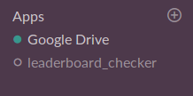
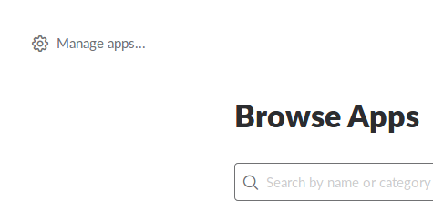
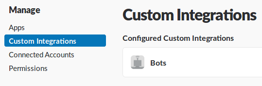
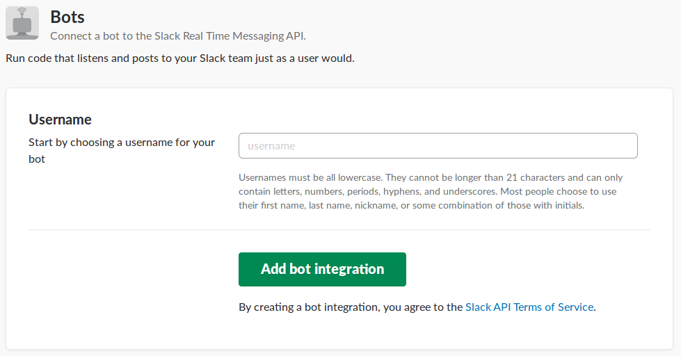

# slackbot-template

[](https://github.com/RichardLitt/standard-readme)
[](https://github.com/Tim-Jackins/slackbot-template/issues)
[](https://github.com/Tim-Jackins/slackbot-template/network)
[](https://github.com/Tim-Jackins/slackbot-template/stargazers)
[](https://github.com/Tim-Jackins/slackbot-template/blob/master/LICENSE)

> This is a template for a python3 based slackbot.

Slack is a super cool tool for large organizations to collaborate efficiently. What's even cooler is having configurable bots in your slack to do automative tasks! The following is an explenation of how to use the included python3 script.

## Table of Contents
- [Background](#background)
- [Install](#install)
	- [Packages](#packages)
	- [Credentials](#credentials)
- [Usage](#usage)
	- [Configurations](#configurations)
	- [Questions](#questions)
- [Contribute](#contribute)
- [License](#license)

## Background
This was my attempt to make a simple python3 slack bot that would post our rank in zero robotics. At the time that I made this I didn't know how to use JavaScript and there's now [a better 'serverless' way to do this](https://github.com/johnagan/serverless-slackbot) which I would recommend checking out.

## Install
### Packages

Clone this repo:
```bash
git clone https://github.com/Tim-Jackins/slackbot_template.git
```

Next install the required python3 packages
```bash
sudo -H pip3 install --trusted-host pypi.python.org -r requirements.txt
```
Ok, you're ready to move to the next step!

### Credentials

In order for the bot you make to communicate with your slack you have to give it some security credentials. These can be obtained in your slack. First go to apps menu by click on apps:



Then click on the manage apps button in the top left part of the screen:



Then click on custom integrations, then bots, then "Add Configuration":



Then type a username (don't worry it can be changed later) and click "Add bot integration": 




Once you have your token and bot id lets save those as evironment variables:
```bash
export SLACK_API_TOKEN={Your bots API token}
```
Next run the script print_bot_id.py and follow the instructions. This will give you the id for the bot which you will then need to to export:
```bash
export SLACK_BOT_ID={Your bots}
```

In order to have the exports everytime you log on add them to the bottom of ~/.bashrc:
```bash
# Exported slack info
export SLACK_API_TOKEN={Your bots API token}
export SLACK_BOT_ID={Your bots}
```

The benefit of exporting is to be able to share your code with people without giving them all of your tokens. Anyways, once you have your tokens you are ready to start your app!

## Usage

You should just be able to run the script.
```bash
python3 run.py
```

### Configurations

Notice the dictionaries being printed out, the slack bot picks up a fair amount of cool data that can be used. The best place to add commands is in the `handle_command` function by adding an `elif` to recognize the desired command.

### Questions

Feel free to send me an email if you have any questions about using the code for something interesting.

## Contribute

Feel free to contribute in the following ways:

- [Open an issue!](https://github.com/Tim-Jackins/slackbot-template/issues/new) but please use [the issue template](docs/issue_template.md)
- Pull Requests are both encouraged and appreciated!
- Say hi!

Please abide by the [code of conduct](docs/CODE_OF_CONDUCT.md).

## License

GPL-3.0 © Jack Timmins
